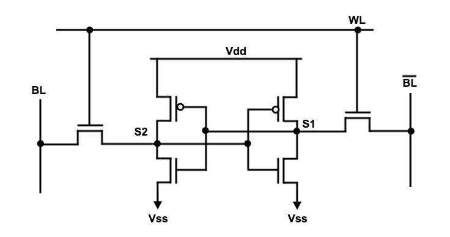

# 8-bit-RAM-analog-design-28nm-CMOS-technology
This repository contains the analog design of a 8-bit RAM in 28nm CMOS Technology implemented using Synopsis Custom Compiler.

# Table of Contents:
 * [Introduction](#Introduction)
 * [Building Blocks for 8-Bit SRAM](#Building-Blocks-for-8-Bit-SRAM)
 * [3X8 Decoder](#3X8-Decoder)
 * [6T SRAM Cell](#6T-SRAM-Cell)
 * [Writer Circuit](#Writer-Circuit)
 * [Sensory Circuit](#Sensory-Circuit)
 * [Tools Used](#Tools-Used)
 * [Pre-Layout Schematics and Simulations](#Pre-Layout-Schematics-and-Simulations)
   * [Schematics](#Schematics)
   * [Simulations](#Simulations)
 * [Netlist of the Circuits](#Netlist-of-the-Circuits)
 * [Author](#Author)
 * [Acknowledgements](#Acknowledgements)
 * [References](#References)

# Introduction:
In modern day computing, the memory elements play a very important role in storing large amounts of data. We all know that SRAM(Static Random Access Memory) is much faster than DRAM (Dynamic RAM), so to utilise SRAM to the fullest we have the concept of caching the memory i.e we save the data in SRAMs on first load so that in the consecutive load time reduces drastically. Here static signifies that the memory will be retained only as long as the RAM is connected to supply. And random access means that we can read/write data from memory irrespective of which sequence the data is present in i.e it will take the same time to access/modify the data irrespective of the bit position. The main advantages of using SRAM is the high switching speed and low power consumption. The applications of this circuit can be a simple memory element, a Lookup table for an FPGA etc. SRAMs are majorly used in server based web applications because the servers are usually switched on all the time. The use of this SRAM is expected to grow further so we are going to design a 8-Bit SRAM based cache memory which is mainly used due to its High performance and Low power in comparison with the DRAM.

# Building Blocks for 8-Bit SRAM:
The components required are a 3X8 Decoder implemented in digital domain using NgVeri, a 1-bit RAM cell which further consists of writer circuit, 6T RAM cell and a sensory circuit all implemented in analog domain using eSIM. The 3X8 Decoder will be used to select the 1-bit RAM cell to which we want to perform the read/write operation to. Basic architecture of a 1-bit SRAM will look like this:

   
  Fig. 1: Basic SRAM Block Diagram:

# 3X8 Decoder:
Decoder is a digital circuit which is used to change a given code into a set of signals. Here we are using a Decoder to select one out of eight 1-bit RAM cells to perform the read/write operation to.

   
  Fig. 2: 3X8 Decoder Block Diagram:

As show above a 3X8 decoder has 4 inputs and 8 outputs. The first three inputs a0,a1,a2 are used to give the coded signal and the fourth signal en acts as an enable. If the en signal is low then all the ouputs y0 to y7 will remain low. The truth table for the 3X8 Decoder is as follows:

   
  Fig. 3: 3X8 Decoder Truth Table:

# 6T SRAM Cell:
6T SRAM is a type of transistor based memory element that uses bi-stable latching circuitry to store a single bit. There are 3 inputs to the 6T RAM cell which are Write line(wl), Bit line(bl) and Bit line bar(blb). When the wl is high the N-MOSFETs on either sides of the latched inverters are switched on so that the value in the bl, blb are transferred to opposite sides of the inverter network overriding the already present value. And when the N-MOSFETs are cut-off the value in the inverter network holds till the inverter network has power supply.

   
  Fig. 4: Standard 6T SRAM Cell Circuit:

# Writer Circuit:
This circuit provides the input to the 6T SRAM cell. The funtionality of this block is to provide bl and blb to the SRAM cell, when the inputs wl and din are high the bl and blb will also be high else both the outputs will be low. For this design the Writer Circuit has been implemented using a simple AND/NAND gate for bl and blb respectively.
    
# Sensory Circuit:
This circuit is used to read the data present in the SRAM cell. It has an Read Enable(r_en) pin which when high gives the value present in the SRAM cell as output.

# Tools Used:
<b>• Synopsys Custom Compiler:</b> 
&emsp;The Synopsys Custom Compiler™ design environment is a modern solution for full-custom analog, custom digital, and mixed-signal IC design. As the heart of the Synopsys Custom Design Platform, Custom Compiler provides design entry, simulation management and analysis, and custom layout editing features. This tool was used to design the circuit on a transistor level.

<b>• Synopsys Primewave:</b> 
&emsp;PrimeWave™ Design Environment is a comprehensive and flexible environment for simulation setup and analysis of analog, RF, mixed-signal design, custom-digital and memory designs within the Synopsys Custom Design Platform. This tool helped in various types of simulations of the above designed circuit.

<b>• Synopsys 28nm PDK:</b> 
&emsp;The Synopsys 28nm Process Design Kit(PDK) was used in creation and simulation of the above designed circuit.

# Pre-Layout Schematics and Simulations:

## Schematics:

### Low Threshold 2-input NOR/OR Gate:
By placing the transistors as shown below we can obtain a low threshold 2-input NOR/OR gate which will be used in building the decoder circuits.

   
  Fig. 5: 2-Input NOR/OR Schematic:

### 2X4 Decoder:
Using the above created NOR/Or gate and inverter we can make the 2X4 Decoder circuit as shown below:

   
  Fig. 6: 2X4 Decoder Schematic:

   
  Fig. 7: 2X4 Decoder Symbol:

### 3-input NOR/OR Gate:
A simple 3-input NOR/OR gate is created so that it can be used in the creation of 3X8 Decoder.

   
  Fig. 8: 3-Input NOR/OR Schematic:

### 3X8 Decoder:
Using the above created 3-input NOR/OR gate and a simple inverted the below schematic of 3X8 Decoder can be created.

   
  Fig. 9: 3X8 Decoder Schematic:

   
  Fig. 10: 3X8 Decoder Symbol:

### 6T SRAM Cell:
Using the simple inverter and interconnecting it as shown below, we obtain a 6T SRAM cell.

   
  Fig. 11: 6T SRAM Schematic:

   
  Fig. 12: Writer Circuit:

### 1-Bit SRAM Cell:
By connecting the writer circuit, 6T SRAM cell and a sensory circuit we can obtain the 1-bit RAM cell as shown below:

   
  Fig. 13: 1-Bit SRAM Symbol:

   
  Fig. 14: 1-Bit SRAM Schematic:

### 4-bit SRAM Schematic:
By interconnecting the 2X4 Decoder and four 1-bit SRAMs we can obtain a 4-bit SRAM. The decoder is used to select the particular 1-bit SRAM to which the read/write operation needs to be performed.

   
  Fig. 15: 4-Bit SRAM Schematic:

### 8-Bit SRAM Schematic:
After creation of the all the above symbols we interconnect the Decoder and the 1-Bit SRAMs as shown in the schematic to create the 8-Bit SRAM. Based on the input given to the decoder the SRAM cell is selected and the read/write operation is performed.

   
   
  Fig. 16: 8-Bit SRAM Schematic:

## Simulations:
After giving the required inputs and pins go to Tools-->PrimeWave to start the simulator. In the PrimeWave select the required model file, Analysis to be done, select the inputs/outputs to be mapped and then start the simulations to get the below outputs.

### 2X4 Decoder:

   
  Fig. 17: Transient Analysis of 2X4 Decoder:

### 3-Input NOR/OR Gate:

   
  Fig. 18: Transient Analysis of 3-Input NOR/OR Gate:

### 3X8 Decoder:

   
  Fig. 19: Transient Analysis of 3X8 Decoder:

### 1-Bit SRAM Cell:

   
  Fig. 20: Transient Analysis of 1-Bit SRAM Cell:

### 4-Bit SRAM Cell:

   
  Fig. 21: Transient Analysis of 4-Bit SRAM Cell:

### 8-Bit SRAM:

   
  Fig. 22: Transient Analysis of 8-Bit SRAM:

# Netlist of the Circuits:
• Refer to the netlist of the 3X8 Decoder here: <a href='3x8_decoder.cir.out'>Netlist</a> 

• Refer to the netlist of the 4-Bit SRAM here: <a href='4_bit_RAM.cir.out'>Netlist</a> 

• Refer to the netlist of the 8-Bit SRAM here: <a href='8bit_RAM.cir.out'>Netlist</a> 

# Author:
• Trinath Harikrishna, B.Tech(ECE), SRM Institute of Science and Technology, Kattankulattur, Chennai-603203.

# Acknowledgements:
• <a href='https://www.synopsys.com/'>Synopsys India</a> 

# References:
[1] Abhishek Agalet “6T SRAM Cell: Design And Analysis” Int. Journal of Engineering Research and Applications, Vol. 4, Issue 3, March 2014. 
[2] J. Rabaey, A. Chandrakasan, and B. Nicolic, Digital Integrated Circuits A Design Perspective, 2nd ed.Prentice Hall, 2003.
